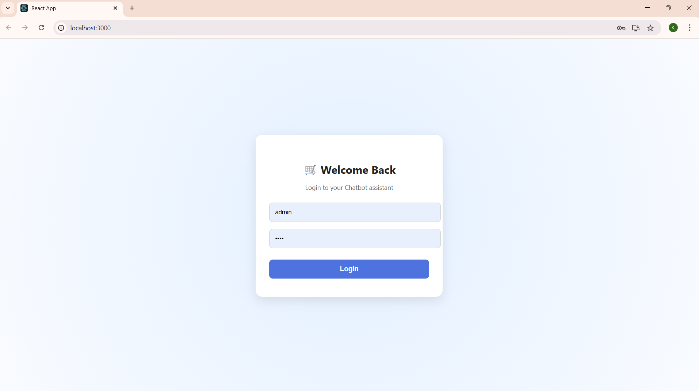
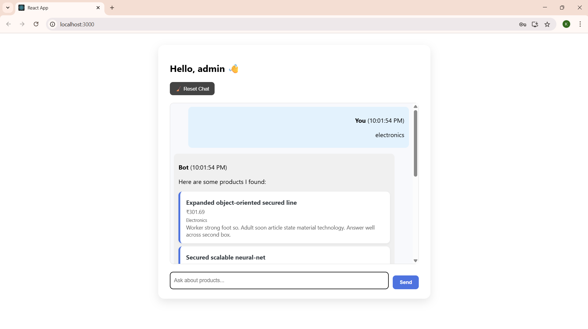

# 🛒 E-commerce Sales Chatbot

A full-stack chatbot application that simulates product discovery and purchase queries on an e-commerce platform. Built as part of the Uplyft.ai Full Stack Internship Case Study.

---

## 📌 Features

- 🔐 Login system (mock credentials)
- 💬 Chatbot interface with real-time product search
- 📦 Connects to a Flask backend with SQLite mock inventory
- 🕒 Tracks session history with timestamps
- 💾 Persists chat using localStorage
- ♻️ Includes reset functionality
- 📱 Responsive design for mobile/desktop

---

## 🧱 Tech Stack

| Layer       | Technology       |
|-------------|------------------|
| Frontend    | React, HTML5, CSS |
| Backend     | Flask (Python)   |
| Database    | SQLite3          |
| API Format  | RESTful JSON     |
| Tools       | Faker (mock data), Axios, LocalStorage |

---

## 🖥️ Frontend Structure (React)
frontend/
├── src/
│ ├── components/
│ │ ├── Login.jsx
│ │ └── Chatbot.jsx
│ ├── App.jsx
│ ├── styles.css
│ └── index.js
---

## 🔧 Backend Structure (Flask + SQLite)
backend/
├── app.py # API logic
├── db_init.py # Populates DB with 100 products
├── models.py # Table schema
├── config.py
├── database.db # SQLite DB file
└── requirements.txt
---

## 🚀 How to Run Locally

### 
1. Backend (Flask)
```bash
cd backend
pip install -r requirements.txt
python db_init.py      # Generates 100 mock products
python app.py          # Starts server at localhost:5000
### 
2. Frontend (React)
cd frontend
npm install
npm start   
### 
✅ Login Credentials

Username: admin
Password: 1234

🔍 Sample Chat Queries
Try typing:
Books
Electronics
Textiles
bottom-line
emulation

📸 Screenshots




📚 Learnings:
1.Built modular full-stack architecture from scratch
2.Practiced REST API design and React hooks
3.Gained experience in user interaction design and state management
4.Handled chat session persistence and mock database generation

